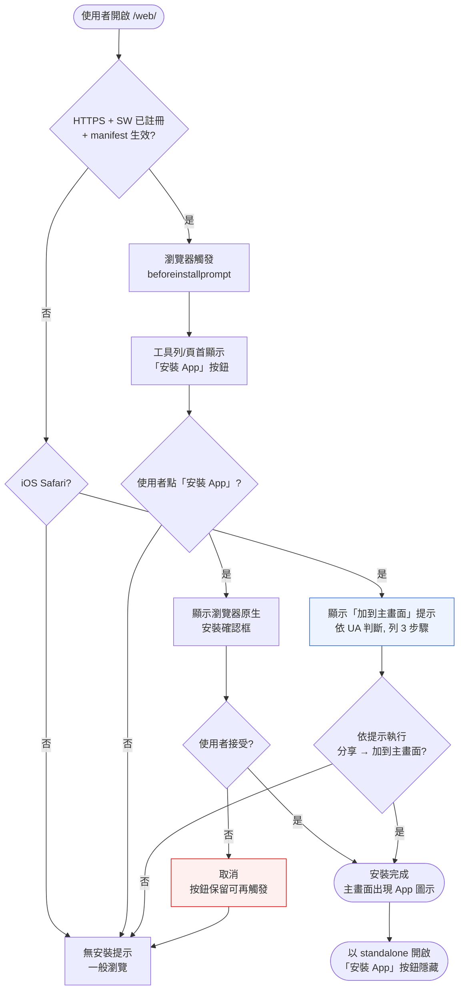
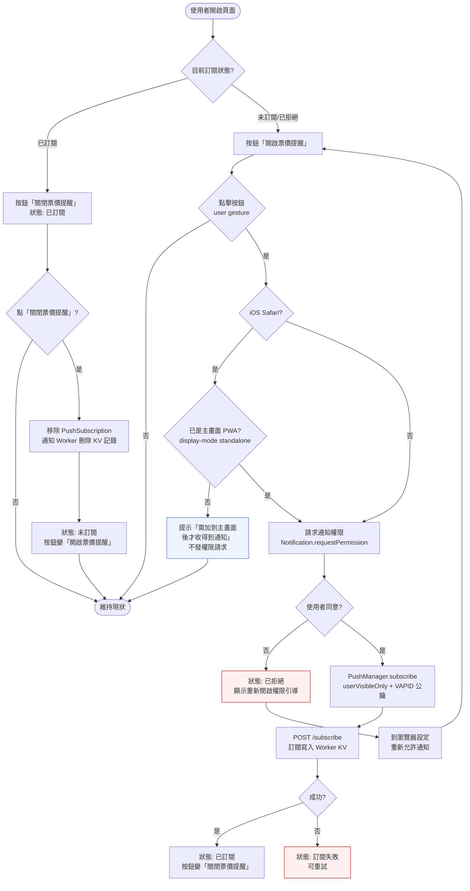
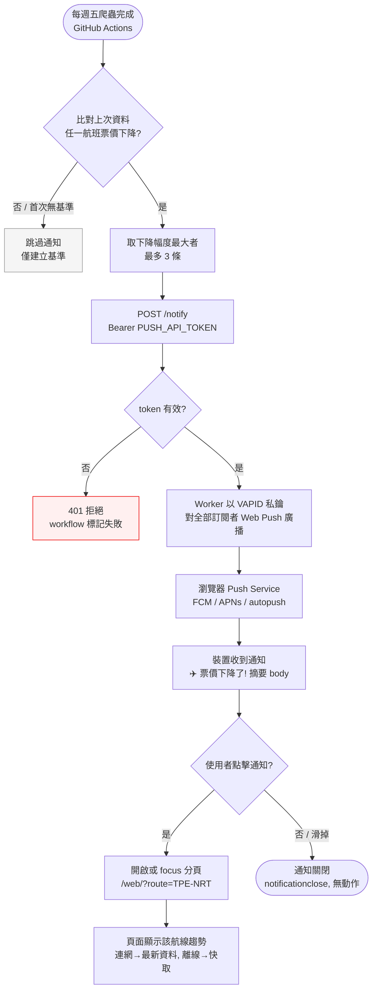

# PWA — Interaction Flow 設計

> 設計日期：2026-08-15
> 狀態：設計完成，待開發
> 上游資料：`docs/tech-decisions/PWA-2026-08-15.md`（D1–D8 決策、T1–T13 任務、Spike S1–S4、通知承載、驗收標準）
> 背景資料：`docs/tech-decisions/離線功能-2026-08-15.md`（既有 SW + IndexedDB 離線能力）、`docs/development/離線功能.md`（既有開發規格）、`docs/interaction-flows/離線功能.md`（既有 5 情境 A–E / E1–E8）
> 範圍：**Phase 1 可安裝**（manifest + 圖示 + iOS + Lighthouse 達標）＋ **Phase 2 推播通知**（Cloudflare Workers 自建 Web Push，drop_last 條件）

---

## 1. 功能概述

**一句話**：把星宇機票價格趨勢頁做成可安裝的 PWA，並在每週五票價下降時主動推播通知，點通知直接跳到該航線趨勢。

**核心價值**：① 票價下降**主動通知**（不用天天開頁，D1 需求回顧）② 強化既有離線體驗 ③ 主畫面 App 圖示提升黏著度 ④ 技術學習（自建 Web Push）。

**兩階段邊界**（D1）：

| 階段 | 內容 | 對應任務 |
|------|------|---------|
| Phase 1 | 可安裝：manifest + 圖示（192/512/maskable/apple-touch-icon 180）+ iOS meta + 安裝按鈕（beforeinstallprompt / iOS「加到主畫面」hint）+ Lighthouse 達標 | T1–T6 |
| Phase 2 | 推播：訂閱 UI（user gesture 才 request permission）+ sw.js push handler + Cloudflare Worker（/vapid-public-key、/subscribe、/notify）+ 爬蟲端 drop_last 偵測 | T7–T13 |

---

## 2. 使用者與場景

| 項目 | 內容 |
|------|------|
| **角色** | 少數親友（< 50 人），公開免登入訪客 |
| **觸發入口** | 開啟 GitHub Pages 網址（`…/AirTicketsPrice/web/`）；每週五爬蟲後由系統自動觸發通知 |
| **前置條件** | Phase 1：HTTPS + SW 已註冊 + manifest 生效（GitHub Pages 天然滿足）；Phase 2：使用者**主動**點「開啟票價提醒」並同意權限；iOS 需先「加到主畫面」 |
| **使用情境** | 見下方情境表 |

**使用情境（全部可追溯 Tech Decision）**：

| 情境 | 描述 | 對應決策/任務 |
|------|------|--------------|
| P1-A 可安裝（Chrome/Edge 桌面、Android） | 符合安裝條件時出現「安裝 App」按鈕 → 安裝 → 主畫面出現圖示，以 standalone 開啟 | D1 / D7 / T3、T4 |
| P1-B iOS 加到主畫面 | iOS Safari 看不到安裝按鈕，依 UA 顯示「加到主畫面」逐步提示 | D7 / T4 |
| P1-C 已安裝狀態 | 以 standalone 模式開啟時隱藏安裝按鈕 | T4 |
| P2-A 開啟票價提醒 | 頁面內點「開啟票價提醒」→ 權限詢問 → 訂閱成功 → 狀態「已訂閱」 | D2 / D5 / T9 |
| P2-B 收到通知與點擊 | 每週五票價下降 → 單則摘要通知（最多 3 條）→ 點擊開啟頁面並聚焦該航線 | D3 / D4 / T8、T10 |
| P2-C 拒絕 / 退訂 | 拒絕權限 → 拒絕引導；已訂閱後點「關閉票價提醒」→ 退訂 | D5 / T8、T9 |
| P2-D iOS 訂閱 | iOS 16.4+ 已加到主畫面的 PWA 才收得到推播，頁面誠實提示 | D5 / D7 / S3 |
| P2-E 離線與通知並存 | 通知點擊後離線開啟頁面 → 沿用既有離線能力（快取繪圖 + 離線橫幅）；訂閱狀態不因離線失效 | D1 / 離線功能文件 |
| P2-F 系統自動觸發 | GitHub Actions 每週五爬蟲完成 → 較上次下降 → 呼叫 Worker 廣播通知（使用者零操作） | D3 / T10、T11 |

---

## 3. 操作流程圖

### 圖 1：安裝流程（Phase 1，T1–T5）

### 圖 2：訂閱 / 退訂流程（Phase 2，T8、T9）

### 圖 3：通知觸發、接收與點擊（Phase 2，D3、D4、T10、T8）

> 圖 3 上方（Cron → Auth）為系統自動流程，使用者無操作；下方（Device → Chart）為使用者端接收與點擊。

---

## 4. 逐步互動說明

### Phase 1：安裝

### 步驟 1：檢查安裝資格（自動）

| | 描述 |
|---|------|
| **觸發** | 使用者首次開啟 `/web/`（連網，HTTPS） |
| **操作前** | 頁面正常載入；`app.js` init 註冊 SW（既有行為，失敗靜默降級） |
| **系統回應** | SW 註冊 + manifest（`web/manifest.webmanifest`）生效後，瀏覽器判斷「可安裝」（T3）；Chrome/Edge/Android 觸發 `beforeinstallprompt`；iOS 不觸發 |
| **操作後** | 符合條件的瀏覽器已具備安裝資格；符合條件時暫存 deferred prompt 並顯示「安裝 App」按鈕（T4） |
| **下一步** | 步驟 2：顯示安裝按鈕（或 iOS 提示） |

### 步驟 2：顯示安裝入口

| | 描述 |
|---|------|
| **觸發** | 步驟 1 完成；或 `beforeinstallprompt` 事件觸發（可於 `appinstalled` / standalone 後隱藏） |
| **操作前** | 頁面已載入，瀏覽器具安裝資格 |
| **系統回應** | Chrome/Edge/Android：顯示「安裝 App」按鈕（deferred prompt 暫存，點擊時才叫出）；iOS Safari（依 UA 判斷，T4）：顯示「加到主畫面」hint（分享 → 加到主畫面，3 步驟），**不顯示**安裝按鈕；已安裝（`display-mode: standalone`）：兩者皆隱藏（T4） |
| **操作後** | 使用者在畫面可見安裝入口；iOS 使用者知道安裝方法 |
| **下一步** | 步驟 3：執行安裝（或直接進入訂閱/瀏覽，見 Phase 2） |

### 步驟 3：執行安裝

| | 描述 |
|---|------|
| **觸發** | 使用者點「安裝 App」（Chrome/Edge/Android） |
| **操作前** | 按鈕可見；deferred prompt 已暫存 |
| **系統回應** | 顯示瀏覽器原生安裝確認框；使用者接受 → 安裝完成、主畫面出現 App 圖示（`icon-192`/`icon-512`/maskable，T1）；取消 → 按鈕保留，可再次觸發 |
| **操作後** | 主畫面出現「票價趨勢」圖示；之後以 standalone 模式開啟（無瀏覽器 UI、`apple-mobile-web-app-capable` 生效） |
| **下一步** | 步驟 4：已安裝模式（或 iOS 步驟 3b） |

### 步驟 3b：iOS 加到主畫面

| | 描述 |
|---|------|
| **觸發** | iOS Safari 使用者依 hint 操作（分享 → 加到主畫面） |
| **操作前** | 頁面顯示 hint；尚未安裝 |
| **系統回應** | iOS 以 `apple-touch-icon`（180，T1）作為主畫面圖示；加入後以 standalone 開啟（D7） |
| **操作後** | 主畫面出現 App 圖示；之後開啟皆 standalone |
| **下一步** | 步驟 4（已安裝模式；Phase 2 中此為 iOS 訂閱的前置條件，P2-D） |

### 步驟 4：已安裝模式

| | 描述 |
|---|------|
| **觸發** | 使用者從主畫面圖示開啟 |
| **操作前** | 已安裝 |
| **系統回應** | `display-mode: standalone` → 全螢幕無瀏覽器工具列；安裝按鈕隱藏；既有離線/SW 行為照常（T4） |
| **操作後** | 使用者獲得 App 般體驗；可繼續 Phase 2 訂閱流程 |
| **下一步** | 步驟 5：檢視訂閱狀態 |

### Phase 2：訂閱 / 通知

### 步驟 5：檢視訂閱狀態（頁面載入時自動）

| | 描述 |
|---|------|
| **觸發** | 使用者開啟頁面（任何模式） |
| **操作前** | 頁面載入完成 |
| **系統回應** | 依 `Notification.permission` ＋ `registration.pushManager.getSubscription()` 顯示狀態（T9）：`default` → 未訂閱、「開啟票價提醒」按鈕；`granted` 且無訂閱 → 未訂閱、可訂閱；`granted` 且有訂閱 → 已訂閱、「關閉票價提醒」按鈕；`denied` → 已拒絕、顯示重新開啟權限引導 |
| **操作後** | 使用者看到正確的訂閱狀態按鈕；**頁面載入不自動彈權限詢問**（D5：親友團體驗優先） |
| **下一步** | 步驟 6：開啟票價提醒（或步驟 8 拒絕引導 / 步驟 7 退訂） |

### 步驟 6：開啟票價提醒

| | 描述 |
|---|------|
| **觸發** | 使用者點「開啟票價提醒」（user gesture，D5） |
| **操作前** | 權限 `default` 或 `granted` 但未訂閱；按鈕可點 |
| **系統回應** | ① 非 iOS：觸發 `Notification.requestPermission()`（瀏覽器原生詢問）→ 同意 → `PushManager.subscribe({ userVisibleOnly: true, applicationServerKey: <VAPID 公鑰> })`（T9）→ 取得訂閱 → `POST /subscribe` 寫入 Worker KV（T8）→ 狀態變「已訂閱」；② iOS：先檢查是否 standalone（P2-D），未安裝 → 顯示「需加到主畫面後才收得到通知」提示，不發權限請求（D5 / S3 保守提示）；已安裝（16.4+）→ 同非 iOS 流程 |
| **操作後** | 按鈕變「關閉票價提醒」＋狀態「已訂閱」；系統會在每週五票價下降時收到通知 |
| **下一步** | 步驟 9：收到通知（系統自動觸發） |

### 步驟 7：關閉票價提醒（退訂）

| | 描述 |
|---|------|
| **觸發** | 已訂閱使用者點「關閉票價提醒」 |
| **操作前** | 狀態「已訂閱」 |
| **系統回應** | 前端移除 `PushSubscription`（`pushManager.getSubscription()` → `unsubscribe()`）→ 通知 Worker 刪除 KV 中的訂閱記錄（T8「訂閱名單由前端按鈕管理」；無後台介面，T13 排除項） |
| **操作後** | 狀態回「未訂閱」，按鈕變「開啟票價提醒」；不再收到票價下降通知 |
| **下一步** | 結束，或步驟 6 重新訂閱 |

### 步驟 8：拒絕權限引導

| | 描述 |
|---|------|
| **觸發** | 權限詢問被拒絕（`denied`）；或使用者先前在瀏覽器設定封鎖通知 |
| **操作前** | 按鈕顯示「開啟票價提醒」；點擊後權限無法再次詢問 |
| **系統回應** | 顯示拒絕引導文案：「通知已封鎖，請到瀏覽器網站設定中允許通知後再回來開啟」（T9 拒絕引導狀態）；不嘗試再彈詢問（瀏覽器會直接回 `denied`） |
| **操作後** | 使用者知道如何自行恢復權限 |
| **下一步** | 使用者到瀏覽器設定允許通知 → 回頁面重新點「開啟票價提醒」 |

### 步驟 9：收到通知（系統自動觸發）

| | 描述 |
|---|------|
| **觸發** | 每週五爬蟲完成後，任一航班票價較上次下降（GitHub Actions 自動，T10） |
| **操作前** | 使用者已訂閱；裝置在線（Push Service 可送達） |
| **系統回應** | 爬蟲端比對上次資料（drop_last）→ 選下降幅度最大最多 3 條 → `POST /notify`（Bearer `PUSH_API_TOKEN`）→ Worker 以 VAPID 私鑰對全部訂閱者 Web Push 廣播 → 裝置收到**單則摘要通知**：title「✈️ 票價下降了！」、body 如「TPE-NRT 東京 8/22–8/30 降至 NT$24,120（原 NT$26,008）」（D4 通知承載）；未下降 / 首次無基準 → 不發通知（風險登錄） |
| **操作後** | 裝置通知中心出現 1 則票價摘要（不會逐航班連發） |
| **下一步** | 步驟 10：點擊通知 |

### 步驟 10：點擊通知 → 開啟航線

| | 描述 |
|---|------|
| **觸發** | 使用者點擊通知（notificationclick） |
| **操作前** | 通知已顯示於通知中心 |
| **系統回應** | `sw.js` 的 `notificationclick` handler（T9）：讀取 `data.url`（**相對路徑** `?route=TPE-NRT`；S2：以 `registration.scope` 為基準拼接 → 解析後 `/web/?route=TPE-NRT`）→ 已有該頁分頁 → focus 並切到該航線；無分頁 → 開啟新分頁 → 頁面載入 `?route=TPE-NRT` 聚焦該航線趨勢圖 |
| **操作後** | 使用者直接看到目標航線最新趨勢（連網＝最新資料；離線＝沿用既有快取繪圖 + 離線橫幅，P2-E） |
| **下一步** | 瀏覽 / 篩選（既有互動） |

---

## 5. 異常處理

| # | 錯誤情境 | 使用者看到的回饋 | 恢復路徑 | 對應決策/任務 |
|---|----------|------------------|----------|--------------|
| E1 | 權限被瀏覽器封鎖（`denied`，先前拒絕或設定封鎖） | 「開啟票價提醒」按鈕 + 拒絕引導文案（去網站設定允許） | 瀏覽器設定允許通知 → 回頁面重新點按鈕 | D5 / T9 |
| E2 | `subscribe` 失敗（網路抖動、push service 暫時不可用、VAPID 公鑰無效） | 狀態「訂閱失敗，請稍後重試」；按鈕可重試；**不影響頁面瀏覽與圖表** | 再點一次按鈕；或重新整理頁面後重試 | D5 / T9 |
| E3 | `/vapid-public-key` 抓取失敗（Worker 未部署 / 掛掉） | 訂閱按鈕停用並提示「提醒功能暫時不可用」；其餘功能完全正常 | 下次頁面載入重試；部署 Worker 後自動恢復 | D2 / T8 |
| E4 | 權限詢問被忽略（關掉詢問框） | 狀態維持「未訂閱」；無錯誤提示 | 再點「開啟票價提醒」重新詢問 | D5 / T9 |
| E5 | push service 回 404/410（訂閱過期，如瀏覽器資料被清） | Worker 廣播時自動刪除失效訂閱（T8）；使用者下次開啟頁面時 `getSubscription()` 為空 → 狀態顯示「未訂閱」 | 重新點「開啟票價提醒」訂閱 | T8 / T9 |
| E6 | `POST /notify` 401（`PUSH_API_TOKEN` 失效） | 無使用者端影響（通知不發）；GitHub Actions workflow 該步驟失敗但資料已 commit（T10/T11） | 維護者輪換 repo secret（風險登錄） | D6 / T10、T11 |
| E7 | `/notify` 時 KV 無任何訂閱者 | Worker 回成功（空廣播）；無通知、無錯誤 | 不需處理 | T8 |
| E8 | iOS 未加到主畫面就點「開啟票價提醒」 | 顯示「需加到主畫面後才收得到通知」提示；不發無效權限請求 | 依提示加到主畫面後再訂閱 | D5 / D7 / S3 |
| E9 | 點通知開啟頁面時目標航線未快取且離線 | 沿用既有離線行為：頁面顯示快取資料 + 離線橫幅；若該航線從未載入 → 「此航線尚未下載，需連網」提示、停留原航線（離線功能 E2） | 連網後重新載入該航線 | D1 / 離線功能 |
| E10 | 點通知時分頁已開啟但顯示其他航線 | focus 既有分頁並切換到通知指定的航線（不重開分頁） | 不需處理 | D4 / T9 |
| E11 | 下降航班超過 3 條 | 只取下降幅度最大 3 條合併為單則摘要，其餘不發（D4 節流） | 不需處理 | D4 / T10 |
| E12 | 首次爬蟲（無上次基準資料） | 跳過通知，僅建立基準（風險登錄） | 下週起正常觸發 | D3 / T10 |
| E13 | 頁面開啟中收到多則舊通知 / 使用者滑掉通知 | `notificationclose` 處理（T9）；點擊行為只對點擊的那則發生 | 不需處理 | T9 |
| E14 | `file://` 本機開啟（無 HTTPS/SW） | SW 不註冊、無 push（僅開發限制）；頁面降級為純記憶體快取（既有行為） | 以 `http://localhost` 或正式網址開啟 | D1 / 離線功能 §9.1 |

---

## 6. 邊界與限制

| 項目 | 限制 |
|------|------|
| **通知觸發條件** | **僅 `drop_last`**（票價較上次抓取下降）；below_avg / new_low / 週摘要**本輪不做**（決策「本輪不做」） |
| **通知頻率** | 與爬蟲同頻：**每週五**爬蟲後發送（維持每週，不擴充每日） |
| **通知內容** | 合併為**單則摘要**、最多 **3 條**、取下降幅度最大者；點擊 deep-link 到 `/web/?route={route}`（以 `registration.scope` 為基準，S2） |
| **使用者規模** | < 50 親友，公開免登入；無訂閱者管理後台、無退訂清單介面（前端按鈕即可） |
| **成本** | 維持 **$0**：GitHub Pages + Cloudflare Workers 免費 tier（100k req/day、KV 1GB，遠超需求）；首次引入 1 個 GitHub repo secret（`PUSH_API_TOKEN`） |
| **iOS 推播** | 僅 **iOS 16.4+ 且已加到主畫面的 PWA** 收得到；未安裝的 Safari 瀏覽器收不到（D5/D7 誠實提示；不做 email 等 fallback） |
| **訂閱單位** | 以**瀏覽器/裝置**為單位（沿用離線快取語意）；無跨裝置同步 |
| **安裝資格** | 需 HTTPS + SW + manifest；`file://` 下不可安裝、不可訂閱 |
| **權限請求** | 僅在 **user gesture**（點擊按鈕）時才 request permission；頁面載入不自動彈 |
| **憑證** | VAPID 公鑰公開（前端）；私鑰與訂閱名單只在 Worker（secret / KV）；token 防陌生人灌爆 KV（D6） |
| **離線並存** | 訂閱狀態、SW 安裝能力與離線快取**彼此獨立**：離線時不發通知（無網），但通知點擊後可離線開啟頁面看快取（P2-E）；離線功能能力不因 PWA 化而改變（BR4 語意） |
| **通知可達性** | 依賴裝置通知設定（勿擾/靜音、OS 層級）——非本專案可控，不在範圍 |
| **爬蟲不變** | `data/`、`api/`、既有 GitHub Actions 爬蟲流程維持原樣；Phase 2 僅在爬蟲完成後**追加** notify 呼叫（T10/T11） |

---

## 7. 驗收檢查清單

> 對應 Tech Decision D8（驗收標準）與各任務（T1–T13）。每項皆為是非題，可直接用於 PR review。

### Phase 1（可安裝）

- [ ] Lighthouse「Installable」稽核 pass（manifest 完整 + SW 控制頁面 + maskable icon）【D8 / S4】
- [ ] Lighthouse「離線 reload」pass（既有情境 D 不因 PWA 化回歸）【D8】
- [ ] `web/manifest.webmanifest` 欄位齊全：name / short_name / start_url（`./`）/ scope（`./`）/ display（standalone）/ icons（192、512、512-maskable）/ theme_color / background_color / lang（zh-Hant）【T2】
- [ ] maskable icon 主體落在 80% safe zone 內【T1】
- [ ] `index.html` 具備：`<link rel="manifest">`、`apple-touch-icon`（180）、`theme-color`、`mobile-web-app-capable`、`apple-mobile-web-app-capable`、`apple-mobile-web-app-status-bar-style`【T3】
- [ ] Chrome/Edge 桌面與 Android：符合安裝條件時顯示「安裝 App」按鈕；點擊 → 原生安裝確認 → 安裝成功 → 主畫面出現圖示【T3/T4】
- [ ] 安裝按鈕只在 `beforeinstallprompt` 後出現；已安裝（`display-mode: standalone`）時隱藏【T4】
- [ ] iOS Safari（依 UA）：顯示「加到主畫面」hint；加到主畫面後以 standalone 開啟且圖示為 apple-touch-icon【T4/D7】
- [ ] 既有 `e2e_smoke`（69 checks）與 `e2e_offline`（105 checks）**全綠，零回歸**【D8】
- [ ] README / `docs/development/` 補「安裝 App」說明【T6】

### Phase 2（推播通知）

- [ ] 頁面載入不自動彈權限；只有點「開啟票價提醒」按鈕（user gesture）才 request permission【D5 / T9】
- [ ] 三態狀態 UI 正確：未訂閱（「開啟票價提醒」）／已訂閱（「關閉票價提醒」）／拒絕（引導文案）【T9】
- [ ] 同意權限 → `PushManager.subscribe`（userVisibleOnly + VAPID 公鑰）→ `POST /subscribe` 成功 → 狀態「已訂閱」【T8/T9】
- [ ] 訂閱失敗（E2）：顯示「訂閱失敗，可重試」，不影響頁面其他功能【T9】
- [ ] 退訂：點「關閉票價提醒」→ 移除本機訂閱 + Worker KV 刪除記錄 → 狀態回「未訂閱」【T8/T9】
- [ ] iOS 未安裝：顯示「需加到主畫面後才收得到」提示，不發無效權限請求【D5 / S3】
- [ ] `sw.js` 新增 `push` handler：收到 push 顯示單則摘要通知（title/body 依通知承載格式）【T9】
- [ ] `notificationclick`：focus 或開啟 `/web/?route={route}` 並顯示該航線；已開分頁時不重開【D4 / T9】
- [ ] `notificationclose`：關閉通知無副作用【T9】
- [ ] Worker `GET /vapid-public-key` 回傳公鑰；`POST /subscribe` 驗證並存 KV；`POST /notify` 驗證 Bearer token → Web Push 廣播；404/410 訂閱自動清理【T8】
- [ ] 爬蟲端 drop_last 偵測：任一航班較上次下降才觸發；首次無基準跳過（E12）【T10】
- [ ] 通知內容節流：合併單則摘要、最多 3 條、取下降幅度最大者【D4 / T10】
- [ ] 爬蟲→Worker 使用 repo secret `PUSH_API_TOKEN`；README 註明 secret 與 Worker 部署步驟【T11 / D6】
- [ ] Playwright mock push service E2E：訂閱流程／push 事件／notificationclick deep-link 全通過【T12 / D8】
- [ ] 全量回歸：`node --test tests/unit/` ＋ `e2e_smoke` ＋ `e2e_offline` 全綠；Lighthouse 複測無 best-practices 回歸【T12 / D8】
- [ ] README / 決策文件補推播說明與 iOS 限制（需安裝後才收得到）【T13】

---

## 關聯文件

| 文件 | 說明 |
|------|------|
| `docs/tech-decisions/PWA-2026-08-15.md` | **主要輸入**：D1–D8 決策、架構、通知承載、T1–T13 任務、Spike S1–S4 |
| `docs/tech-decisions/離線功能-2026-08-15.md` | 背景：既有 SW + IndexedDB 離線能力（方案 C、E1–E8） |
| `docs/development/離線功能.md` | 背景：既有開發規格（app shell 6 檔、sw.js 行為、離線 UX） |
| `docs/interaction-flows/離線功能.md` | 背景：既有互動流程（5 情境 A–E + E1–E8）；P2-E 沿用其離線語意 |
| `web/sw.js` / `web/app.js` / `web/index.html` | 現況實作：SW 只兜 shell 6 檔不攔 `api/`；`app.js` cache-first + 離線狀態層；Phase 2 在此之上新增 push handler 與訂閱 UI |

> **下游建議**：本文件完成後，可接續產出 BDD（`docs/bdds/PWA.feature`）、開發規格（`docs/development/PWA.md`）與測試計畫，再依既有 pipeline 執行（Tech Decision「決策後續」）。
