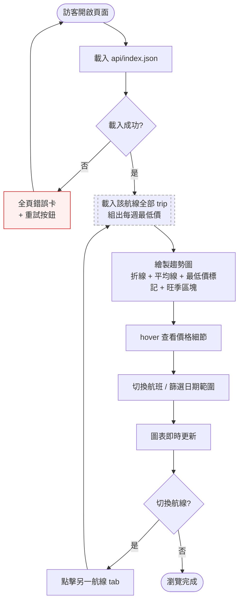

# 票價趨勢圖 — Interaction Flow 設計

> 設計日期：2026-08-14
> 狀態：設計完成，待開發
> 上游資料：`api/index.json` / `api/latest.json` / `api/trips/*.json`（GitHub Pages 靜態 API）

---

## 1. 功能概述

**一句話**：讓公開訪客一眼看出星宇航空各航線「未來 40 週中哪週出發最便宜」。

**核心價值**：把每週爬到的票價轉成直覺的趨勢圖，用最低價標記、平均線與旺季提示輔助購買決策，縮短比價時間。

---

## 2. 使用者與場景

| 項目 | 內容 |
|------|------|
| **角色** | 公開訪客（想買星宇日本航線機票的人），不需登入 |
| **觸發入口** | 直接開啟 GitHub Pages 網址（經分享連結進入） |
| **前置條件** | 無帳號需求；`api/index.json` 可存取（Pages / raw / jsDelivr 任一） |

**使用情境**：

- **情境 A（找便宜週）**：規劃 2027 年初日本旅遊，想知道哪週出發最便宜 → 看 40 週曲線 + 最低價標記
- **情境 B（旺季確認）**：鎖定過年或櫻花季出發，確認是否為價格高峰 → 看旺季底色區塊與該區價格
- **情境 C（單週評估）**：已選定週次，確認價格是否低於平均 → hover 看與平均價差幅

---

## 3. 操作流程圖



---

## 4. 逐步互動說明

### 步驟 1：開啟頁面

| | 描述 |
|---|------|
| **觸發** | 訪客在瀏覽器輸入網址（或點分享連結） |
| **操作前** | 尚未載入任何資料，頁面顯示標題與載入骨架 |
| **系統回應** | 載入 `api/index.json`；成功後開始並行載入該航線所有 trip 檔；頂部顯示進度 |
| **操作後** | 顯示頁面標題、資料更新時間（generated_at）、航線 tab（東京 / 大阪）、圖表區骨架 |
| **下一步** | 步驟 2：檢視預設航線趨勢圖 |

### 步驟 2：檢視預設航線（東京）趨勢圖

| | 描述 |
|---|------|
| **觸發** | 頁面載入完成，預設顯示第一條航線 TPE-NRT |
| **操作前** | 圖表區顯示載入骨架（skeleton） |
| **系統回應** | 組出「每週最低價」資料並繪圖：折線、平均價虛線、最低價標記（金額 + 日期）、旺季底色區塊、售罄週標記 |
| **操作後** | 顯示完整圖表：X 軸為 40 個出發週、Y 軸為 TWD；圖例含「每週最低價 / 平均價 / 旺季」 |
| **下一步** | 步驟 3：hover 查看價格細節 |

### 步驟 3：hover 查看價格細節

| | 描述 |
|---|------|
| **觸發** | 滑鼠移到曲線上任意點 |
| **操作前** | 圖表一般顯示狀態 |
| **系統回應** | 顯示 tooltip：出發日期、回程日期、價格（TWD）、與平均價差幅（便宜 / 貴 N%）、該週最低價航班號 |
| **操作後** | tooltip 顯示於該點上方；滑鼠移開後消失 |
| **下一步** | 步驟 4 或步驟 5 |

### 步驟 4：切換航班顯示

| | 描述 |
|---|------|
| **觸發** | 點圖表工具列「航班」下拉，選擇「全部（每週最低價）/ JX 800 / JX 802 / JX 804」 |
| **操作前** | 顯示每週最低價主線 |
| **系統回應** | 個別航班模式：只畫該航班 40 週價格線，缺資料週顯示斷點；切回「全部」：回到每週最低價線 |
| **操作後** | 圖表更新，工具列標註當前模式 |
| **下一步** | 步驟 5 |

### 步驟 5：篩選日期範圍

| | 描述 |
|---|------|
| **觸發** | 點工具列「未來 3 / 6 / 12 個月 / 全部」按鈕 |
| **操作前** | 顯示全部 40 週 |
| **系統回應** | X 軸縮放到所選範圍；最低價標記依可見範圍重新計算；平均線維持全域基準（避免比較基準漂移）；旺季區塊保留 |
| **操作後** | 圖表只顯示範圍內週次，標題顯示「顯示 3 個月（共 N 週）」 |
| **下一步** | 步驟 6 |

### 步驟 6：切換航線

| | 描述 |
|---|------|
| **觸發** | 點頁面頂部「大阪 KIX」tab |
| **操作前** | 顯示東京趨勢圖 |
| **系統回應** | 切換資料來源為 TPE-KIX（若已載入則直接繪圖）；保留目前的航班模式與日期範圍設定（若目前航班在新航線不存在，例如東京 JX 800 → 大阪，則回退「全部（每週最低價）」並以新航線航班重建選項） |
| **操作後** | 顯示大阪 40 週趨勢圖，標題與圖例更新 |
| **下一步** | 回到步驟 2–5 循環瀏覽，或結束 |

---

## 5. 異常處理

| 錯誤情境 | 使用者看到的回饋 | 恢復路徑 |
|----------|------------------|----------|
| `api/index.json` 載入失敗（網路斷線 / Pages 異常） | 全頁錯誤卡：「資料載入失敗」+ 重試按鈕 | 點「重試」重新載入；連續失敗顯示錯誤代碼 |
| 某週 trip 檔不存在（該週未抓到資料） | 曲線上該週出現斷點；hover 顯示「本週無資料」 | 不需操作；下週爬蟲補上後自動填補 |
| 該週全部航班售罄 | 該週 X 軸下方標示「售罄」灰字，曲線斷開 | 不需操作 |
| 資料過舊（超過 14 天未更新） | 頂部黃色警示：「資料可能過時，上次更新：YYYY-MM-DD」 | 不需操作；等待下週爬蟲執行 |
| 無任何 trip 資料（全新專案） | 空狀態：插圖 +「尚無價格資料，每週五更新」 | 不需操作；資料出現後自動顯示 |
| CORS / 網域來源問題 | 錯誤卡 + 提示改用 Pages 網址開啟 | 重試 / 更換資料來源路徑 |

---

## 6. 邊界與限制

| 項目 | 限制 |
|------|------|
| **存取權限** | 公開頁面，不需登入 |
| **資料更新頻率** | 每週五（爬蟲排程）；頁面顯示 generated_at 供使用者判斷新鮮度 |
| **價格定義** | 來回總價 TWD（去程週六 → 回程下週日）、經濟艙、星宇直營航班 |
| **時間範圍** | 未來 40 週（`NUM_WEEKS=40` 設定）；超出範圍無資料 |
| **歷史深度** | 目前僅 1 筆（2026-08-14 首次爬蟲）→「趨勢」暫呈現為「跨出發週的價格比較」；隨時間累積後可延伸同 trip 歷史走勢視圖（未來優化） |
| **載入效能** | 每航線 40 個 trip 小檔，兩航線共 80 個；採並行 fetch + 記憶體快取，行動網路下顯示載入進度 |
| **CDN 延遲** | jsDelivr 快取可能延遲最新資料最多 24h → 預設使用 Pages 直連網址 |
| **支援範圍** | 幣別固定 TWD；不支援艙等、人數、單程、其他航空公司（資料模型目前無） |
| **並發** | 靜態頁面無伺服器壓力；不支援個人化（如追蹤清單） |

---

## 7. 驗收檢查清單

- [ ] 開啟頁面不需登入，首次載入 3 秒內出現第一張圖（第二次起 <1 秒，快取生效）
- [ ] 預設顯示第一條航線（東京）的 40 週曲線
- [ ] 頁面頂部顯示「資料更新時間」（來自 index.json 的 generated_at）
- [ ] 曲線每個點 = 該週最低價；hover 顯示日期、價格、與平均價差幅、最低價航班號
- [ ] 最低價週有明顯標記 + 金額 label
- [ ] 平均價以虛線呈現；hover 任一點顯示「比平均便宜 / 貴 N%」
- [ ] 旺季區塊（過年 2027-01-30 前後、櫻花季 2027-03 下旬起）有底色與名稱標籤
- [ ] 航班下拉切換（全部 / 個別航班）後曲線正確更新，缺資料週顯示斷點
- [ ] 日期範圍按鈕（3 / 6 / 12 個月 / 全部）切換後 X 軸正確縮放
- [ ] 航線 tab（東京 / 大阪）切換後圖表與標題更新，且保留範圍與航班設定
- [ ] `index.json` 載入失敗 → 顯示錯誤卡 + 重試按鈕，點重試可恢復
- [ ] 缺資料週顯示斷點，hover 顯示「本週無資料」
- [ ] 售罄週有「售罄」標示
- [ ] 資料超過 14 天未更新 → 顯示黃色過時警示
- [ ] 手機寬度（375px）下圖表可正常閱讀，tooltip 不溢出螢幕
- [ ] 頁面無需說明書即可理解（標題、圖例、單位清楚）

---

## 附錄 A：資料組裝邏輯（供實作參考）

```
1. fetch api/index.json
   → 取得 routes（TPE-NRT / TPE-KIX）與 trips 清單（每週一檔）
2. 對每條航線，並行 fetch api/trips/{route}_{outbound}_{return}.json × 40
3. 每個 trip 檔內 flights[] 每班機取 history 最新一筆 price_total（= 目前價格）
4. 每週價格 = 該週所有航班最低價（符合「找最便宜週」核心目的）
5. 平均線 = 全部週最低價的平均；最低價標記 = min 點
6. 旺季區塊 = 已知日期區間（過年 / 櫻花季）於圖上標底色
```

## 附錄 B：設計決策備註

| 決策點 | 選擇 | 理由 |
|--------|------|------|
| 「單頁一次看全部」詮釋 | 單頁儀表板，航線用 tab 切換 | 所有功能一頁完成、無多層導覽；未來若要「雙航線並排比較」可加選項 |
| 每週價格基準 | 該週最低價（非平均價） | 符合「找最便宜出發週」的核心目的 |
| 篩選範圍時平均線 | 維持全域平均 | 比較基準不漂移；最低價標記隨可見範圍重算 |
| 航班切換 | 「全部（最低價）」為主線 + 個別航班模式 | 40 週 × 3 航班同時畫線過於雜亂 |
| 技術 | 本次不決定（使用者選擇先出設計） | 開發前可再評估 Chart.js / ECharts / 框架 |
