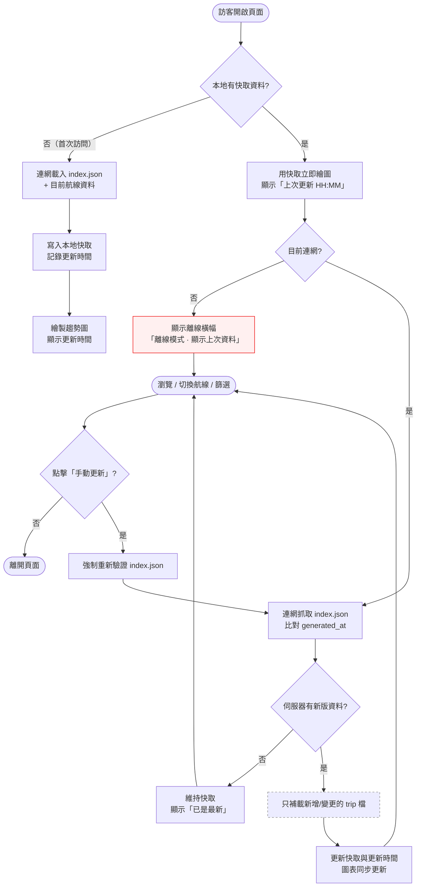

# 離線功能 — Interaction Flow 設計

> 設計日期：2026-08-15
> 狀態：設計完成，待開發
> 上游資料：`api/index.json`（含 `generated_at`）/ `api/trips/*.json`（GitHub Pages 靜態 API）

---

## 1. 功能概述

**一句話**：讓訪客再次開啟頁面時不用重載全部資料——有網路時只補載新增/變更的部分，沒網路時直接看上次載入的快取，並保留手動更新。

**核心價值**：把「每次進入都全量抓取」改成「快取優先 + 增量更新」，降低載入等待、支援離線瀏覽，且使用者隨時可手動強制更新。

---

## 2. 使用者與場景

| 項目 | 內容 |
|------|------|
| **角色** | 公開訪客（想買星宇日本航線機票的人），不需登入 |
| **觸發入口** | 直接開啟 GitHub Pages 網址（再次開啟 / 從書籤或分享連結進入） |
| **前置條件** | 首次訪問需連網（無資料可離線）；之後有快取即可離線開啟 |

**使用情境**：

- **情境 A（首次訪問）**：第一次開頁面，連網載入 index + 航線資料，寫入快取並記錄更新時間
- **情境 B（再次訪問・連網・無新資料）**：快取秒開，背景比對 `generated_at` 相同 → 顯示「已是最新」，不重抓任何檔案
- **情境 C（再次訪問・連網・有新資料）**：快取秒開，背景比對到新版 → 只補載新增/變更的 trip 檔，圖表自動更新
- **情境 D（離線訪問）**：飛機上/沒網路時開啟 → 顯示上次快取資料 + 離線橫幅，趨勢圖照常可操作
- **情境 E（手動更新）**：使用者主動點「手動更新」→ 強制重新驗證最新資料（不受自動比對結果影響）

---

## 3. 操作流程圖

> 子流程說明：連網狀態由瀏覽器 `navigator.onLine` + 實際請求結果共同判斷；請求失敗即視為離線，不因 `onLine` 誤判而卡住。

---

## 4. 逐步互動說明

### 步驟 1：首次訪問（無快取，需連網）

| | 描述 |
|---|------|
| **觸發** | 訪客第一次開啟頁面，或清除瀏覽器資料後開啟 |
| **操作前** | 本地無任何快取；頁面顯示全頁 skeleton 載入中 |
| **系統回應** | 連網抓取 `api/index.json` → 依序載入目前航線的 trip 檔 → 全部成功後寫入本地快取並記錄更新時間 |
| **操作後** | 繪製趨勢圖；右上角顯示更新時間；「手動更新」按鈕可用 |
| **下一步** | 步驟 5：瀏覽 / 切換航線 |

### 步驟 2：再次訪問・連網・伺服器無新資料

| | 描述 |
|---|------|
| **觸發** | 訪客第二次（含之後）開啟頁面，且目前連網 |
| **操作前** | 本地已有快取；頁面以快取資料立即繪圖，右上角顯示「上次更新 HH:MM」 |
| **系統回應** | 背景抓取 `api/index.json`，比對 `generated_at` 與本地記錄 → 相同 → 不抓取任何 trip 檔，維持快取 |
| **操作後** | 頁面無全頁 loading（秒開）；更新時間旁顯示「已是最新」；若伺服器時間較舊則顯示「資料可能過時」警示 |
| **下一步** | 步驟 5：瀏覽 / 切換航線 |

### 步驟 3：再次訪問・連網・伺服器有新資料

| | 描述 |
|---|------|
| **觸發** | 訪客再次開啟頁面，連網，且伺服器 `generated_at` 比本地記錄新（如每週五爬蟲後） |
| **操作前** | 快取立即繪圖（同步驟 2 操作前狀態），背景開始比對 |
| **系統回應** | 比對發現新版 → 只補載**新增或變更**的 trip 檔（不重抓未變更者）→ 更新快取與更新時間 → 圖表與摘要同步更新 |
| **操作後** | 圖表出現最新價格；更新時間更新為新版 `generated_at`；「已是最新」狀態取代短暫的「更新中」提示 |
| **下一步** | 步驟 5：瀏覽 / 切換航線 |

### 步驟 4：離線訪問

| | 描述 |
|---|------|
| **觸發** | 訪客在無網路環境（飛航模式、訊號不良）開啟頁面 |
| **操作前** | 本地有快取（之前至少成功載入過一次） |
| **系統回應** | 直接用快取繪製趨勢圖；頁首顯示離線橫幅「離線模式 · 顯示上次資料（HH:MM）」；背景比對自動略過，不發任何請求 |
| **操作後** | 趨勢圖、航班切換、日期範圍篩選、hover、Summary 三卡全部可正常操作；「手動更新」按鈕顯示「離線中，無法更新」並停用 |
| **下一步** | 步驟 5：瀏覽 / 切換航線 |

### 步驟 5：瀏覽 / 切換航線（含離線時）

| | 描述 |
|---|------|
| **觸發** | 訪客點擊航線 tab、切換航班、篩選日期範圍 |
| **操作前** | 目前航線資料已顯示 |
| **系統回應** | 連網時：切換到未載入航線 → 連網載入該航線 trips 並寫入快取；離線時：切換到**已快取**航線 → 直接顯示，切換到**從未載入**航線 → 顯示「此航線尚未下載，需連網」提示並停留原航線 |
| **操作後** | 圖表與摘要更新為目標航線資料（離線未下載航線維持原畫面） |
| **下一步** | 步驟 6：手動更新，或離開頁面 |

### 步驟 6：手動更新

| | 描述 |
|---|------|
| **觸發** | 訪客點擊「手動更新」按鈕 |
| **操作前** | 頁面正在顯示快取或已是最新資料；按鈕為可用狀態 |
| **系統回應** | 連網時：強制重新抓取 `api/index.json` 並比對（不受自動比對結果影響），有新版則補載變更資料、更新快取與更新時間；無新版則顯示「已是最新」；離線時：按鈕停用並顯示「離線中，無法更新」 |
| **操作後** | 資料回到最新狀態（或維持原狀並顯示「已是最新」）；更新時間同步更新 |
| **下一步** | 瀏覽完成，離開頁面 |

---

## 5. 異常處理

| # | 錯誤情境 | 使用者看到的回饋 | 恢復路徑 |
|---|----------|------------------|----------|
| E1 | 首次訪問即離線（無快取可顯示） | 錯誤卡「需要網路才能首次載入資料」+ 重試按鈕 | 連網後按「重試」回到步驟 1 |
| E2 | 離線時切到從未載入的航線 | 該航線 tab 顯示提示「此航線尚未下載，需連網」；停留原航線 | 連網後切換，或等待下次自動補載 |
| E3 | 背景比對時 `index.json` 抓取失敗（網路抖動） | 不中斷瀏覽；更新時間旁顯示「更新失敗，稍後自動重試」 | 下次開啟頁面或按「手動更新」重試 |
| E4 | 增量補載時部分 trip 檔失敗 | 已成功的先更新並顯示；失敗者保留舊版，顯示「部分資料更新失敗」 | 下次自動/手動更新時重試失敗項目 |
| E5 | 瀏覽器儲存空間不足 | 提示「空間不足，已保留最新資料」 | 自動改用「只保留最新」策略；使用者可清除瀏覽器資料重來 |
| E6 | 伺服器檔案被移除（404） | 本地對應快取一併移除，不顯示錯誤卡 | 不需處理；下次以伺服器為準 |
| E7 | 離線時按「手動更新」 | 按鈕停用 + 文字「離線中，無法更新」 | 連網後按鈕自動恢復可用 |
| E8 | 使用者在無痕/另一瀏覽器開啟 | 等同首次訪問（快取以瀏覽器為單位） | 連網載入一次即有快取 |

---

## 6. 邊界與限制

| 項目 | 限制 |
|------|------|
| **離線可看範圍** | 僅限「上次成功載入過」的航線與資料；從未載入的航線離線不可用（E2） |
| **快取儲存** | 以瀏覽器為單位（localStorage / IndexedDB），不跨裝置、不跨無痕分頁同步 |
| **更新比對基準** | `api/index.json` 的 `generated_at`（每週五爬蟲後更新）；比對相同即「已是最新」，不重抓任何 trip 檔 |
| **增量範圍** | 只補載「新增或變更」的 trip 檔；未變更者以快取為主，不重載 |
| **首次訪問** | 仍需連網（無資料可離線）；離線能力從第二次訪問起生效 |
| **手動更新** | 連網時永遠可用，且強制重新驗證；離線時停用（E7） |
| **資料容量** | index ~9KB + trips 159 檔（每檔 ~1-2KB），全量約數百 KB，正常瀏覽器配額內；仍設計空間不足降級（E5） |

---

## 7. 驗收檢查清單

- [ ] 首次訪問（連網）：載入成功 → 頁面顯示更新時間，本地產生快取
- [ ] 再次訪問（連網・伺服器無新版 `generated_at`）：秒開、無全頁 loading、顯示「已是最新」、未重新抓取任何 trip 檔
- [ ] 再次訪問（連網・伺服器有新版）：只補載新增/變更 trip 檔，圖表與更新時間自動更新
- [ ] 再次訪問（離線・有快取）：顯示快取趨勢圖 + 離線橫幅，切航班、篩選日期、hover、Summary 全部可用
- [ ] 離線時切到從未載入航線：顯示「需連網」提示，不跳出錯誤卡、不白屏
- [ ] 「手動更新」連網時可強制重新驗證；離線時停用並提示
- [ ] 更新時間顯示與伺服器 `generated_at` 一致時標示「已是最新」，不一致時顯示「資料可能過時」
- [ ] 首次訪問即離線：顯示「需要網路」錯誤卡 + 重試按鈕
- [ ] 部分 trip 更新失敗：不阻斷其餘資料更新，失敗項目下次重試
- [ ] 斷線重連後：不需重新整理頁面即可恢復自動更新流程（或下次開啟自動恢復）
- [ ] 既有功能無回歸：趨勢圖繪製、航線切換、篩選、Summary 三卡行為不變

---

## 關聯文件

| 文件 | 說明 |
|------|------|
| `docs/bdds/離線功能.feature` | Gherkin BDD（23 個 Scenario，含 E1–E8 異常、邊界、商業規則） |
| `docs/tech-decisions/離線功能-2026-08-15.md` | 技術決策（D1–D7：方案 C 混合架構、IndexedDB、generated_at 比對、條件式增量同步） |
| `docs/test-plans/離線功能測試計畫.md` | 測試計畫（66 案例：F- / INT- / E2E- / MAN-） |
| `docs/development/離線功能.md` | 開發規格書（前端實作規格、資料流、邊界條件、開發順序 DAG） |
